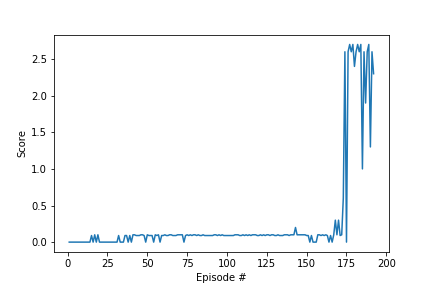

# Report: Project 3 - Collaboration and Competition

## Method: MADDPG

### Learning Algorithm
In this project, an adapation fo the **Deep Deterministic Policy Gradient** (DDPG) algorithm is used, a so-called **Multi-Agent DDPG** ([MADDPG](https://arxiv.org/pdf/1706.02275.pdf)). 

During training, the critic networks for each agent uses extra information such as the states observed and the actions taken by all the other agents. One actor for each agent is applied, and each agent has only access to its own observations and actions. During the exectution time, only actors are present and hence only observations and actions are used. A learning critic for each agent allows to use a different reward structure for each actor. The algorithm can therefore in collaborative, competitive, and mixed scenarios.

In this project, two agents are used which represent the two players.

### Hyperparameters

The following hyperparameters turned out to lead to an efficient training:
- replay buffer size: 1e6
- minibatch size: 256
- discount factor gamma: 0.99
- tau for soft upadte of target parameters: 1e-2
- learning rate of actor: 1e-3
- learning rate of critic: 1e-3
- L2 weight decay: 0
- Maximum number of timesteps: 1000
- Epsilon decay factor: 0.9999

### Nueral Network Architecture
Two separate neural netwoks are used with the following setup:
#### Actor:
- Input: state-size (24x1)
- Fully-connected layer with RELU: 400 nodes
- Batch normalization layer 1D
- Fully-connected layer with RELU: 300 nodes
- Output layer with tanh: 4 nodes

#### Critic:
- Input: state-size (24x1)
- Fully-connected layer with RELU: 256 nodes
- Batch normalization layer 1D
- Fully-connected layer with RELU: 128 nodes
- Output layer: 1 nodes

## Rewards Plot - The solved environment

Criterion for solving the environment:

>The task is episodic, and in order to solve the environment, your agents must get an average score of +0.5 (over 100 consecutive episodes, after taking the maximum over both agents). Specifically,

>After each episode, we add up the rewards that each agent received (without discounting), to get a score for each agent. This yields 2 (potentially different) scores. We then take the **maximum** of these 2 scores.
This yields a single score for each episode.
>The environment is considered solved, when the average (over 100 episodes) of those scores is at least +0.5.

This environment has been solved in: 192 episodes. The plot below shows the max rewards (of the two agents) obtained during the training.

Results run in Udacity GPU environment can be found in:
- Main file with results: *Tennis_trained.ipynb*
- *.pth contain stored checkpoint files. _final.pth contain the final version of the trained neural network weights
- ddpg_agent.py and model.py contain the adapted agents and model code
- workspace_utils.py provides the active_session function to allow long training runs on Udacity GUP workspace (provided by Udacity support)

## Ideas for future work
- Alternative neural network architecutre for agent and critic
- Alternative multi-agent architectures
